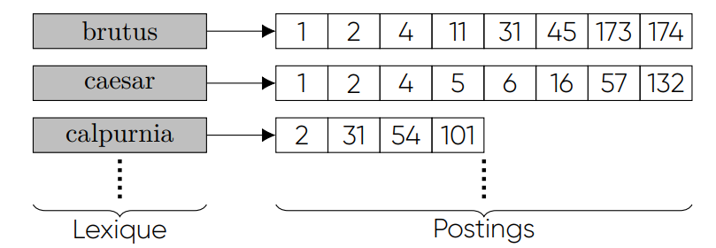

# Indexation et recherche d'information

## Fiches code et fichiers

### Composition d'un index:

- __Token__: chaine de caractère dans un document 

    __mot__ (__type__) dans le texte + le __numérot du document__ (__doc_id__) dans lequel il est situé

    Classe ./src/indexation/content/Token.java
    
- __Tokenizer__: Transforme Une String ou tout un ensemble de documents 

    ./src/indexation/processing/Tokenizer

- __Normalizer__: Normalise une liste de Token (ou une String)
  
  Supprime les signes diacritiques et en les passant en minuscules.

  Index1/src/indexation/processing/Normalizer.java

- __Postings__: Correspond au numérot du document contenant un token 

    ./src/indexation/content/Posting.java

- __IndexEntry__: représent une entrée dans un index, composé d'un token une liste de postings etla fréquence d'apparition de ce toiken dans le corpus

    1 Token -> liste de postings

    /indexation/content/IndexEntry.java

- __AbstractIndex__: Classe abstraite représentatn un Index inverse

    Index Inverse: Liste d'__IndexEntry__ = 1 __Token__ asssocié à une liste de __Posting__

    
    <!--  -->

    /indexation/AbstractIndex.java

    - __AbstractIndex.___indexCorpus_____: Réalise la construction de l'index (voir Construction de l'Index)

    - __AbstractIndex___write_____: Sérialise un index pour le placer dans un fichier compressé

  - __ArrayIndex__: Version de l'index inverse avec un Tableau d'__IndexEntry__

    /indexation/ArrayIndex.java

  - __HashIndex__: Version de l'index inverse avec une __HashMap__ d'__IndexEntry__

    /indexation/HashIndex.java

  - __TreeIndex__: Version de l'index inverse avec une __TreeMan__ d'__IndexEntry__

    /indexation/TreeIndex.java

----

### Construction d'un Index

étapes de Construction

1. Obtenir une liste de paires (terme, docID) représentant le corpus
2. Trier cette liste par terme puis docID
3. Fusionner les occurrences multiples relatives au même document
4. Grouper les occurrences multiples relatives à des documents différents afin de produire les
listes de postings.

- __Builder__: Construit de l'index à l'aide de ses différentes fonctions

    ./src/indexation/processing/Builder.java

    1. __Tokenizer.___tokenizeCorpus_____: Obtenir une liste de paires (terme, docID) représentant le corpus

        - Retourne la liste des __Token__ et leur docId dans le corpus

    2. __AbstractIndex.___buildIndex_____:

        - Prend en paramètre la liste des tokens normalisés  

            Trie les __Tokens__ par terme puis docID

        - Renvoie un objet représentant l’index construit

    3. __Builder.___filterTokens_____:

        - Reçoit la liste triée des tokens normalisés

        - Supprime les occurrences multiples

    4. __Builder.___buildPostings_____:

        - Reçoit la liste triée filtrée des tokens normalisés, ainsi qu’un index vide

        - Construit les __IndexEntry__ à placer dasn l'index le __Token__ associé et la liste de __Posting__

---

### Tests et outils:

- Test1
  
  ./src/Test1.java

  - __Test1.___testIndexation_____: Teste La création d'un index

    Fait appel à la fonction __AbstractIndex.___indexCorpus_____

---

### Outils

- __FileTools__:

    - __FileTools.___getFileNamesFromPostings_____:

      - Reçoit une liste de postings
      - Renvoie la liste des noms de fichier correspondant aux docIds

    - __FileTools.___getIndexFile_____: Désérialise un fichier index et le tranforme en un __Index__

---

### Configuration

- __Configuration__

    ./src/tools/Configuration.java

    - __Configuration.___setCorpusName___: spécifier le nom du corpus à traiter par l'index.

----

### Requêtes

- __AndQueryEngine__: Gestion des requêtes ET

    ./src/query/AndQueryEngine

    - __AndQueryEngine.___splitQuery_____: tokéniser et normaliser la chaîne de caractères reçue

        Retourne une liste de Liste de __Posting__ associès à chaques termes de la requête
